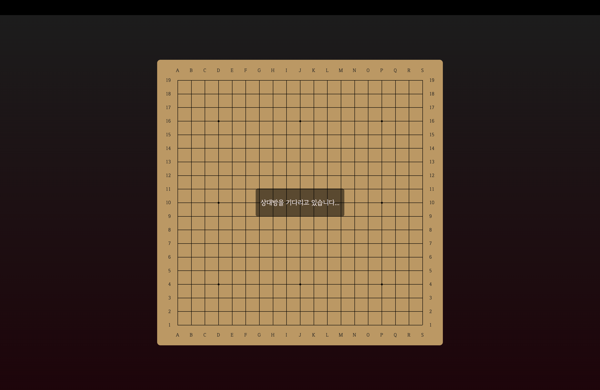
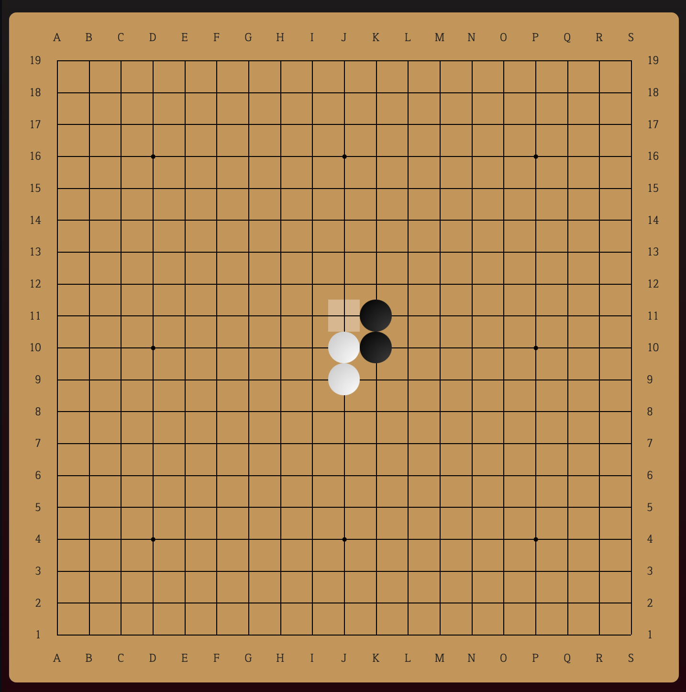
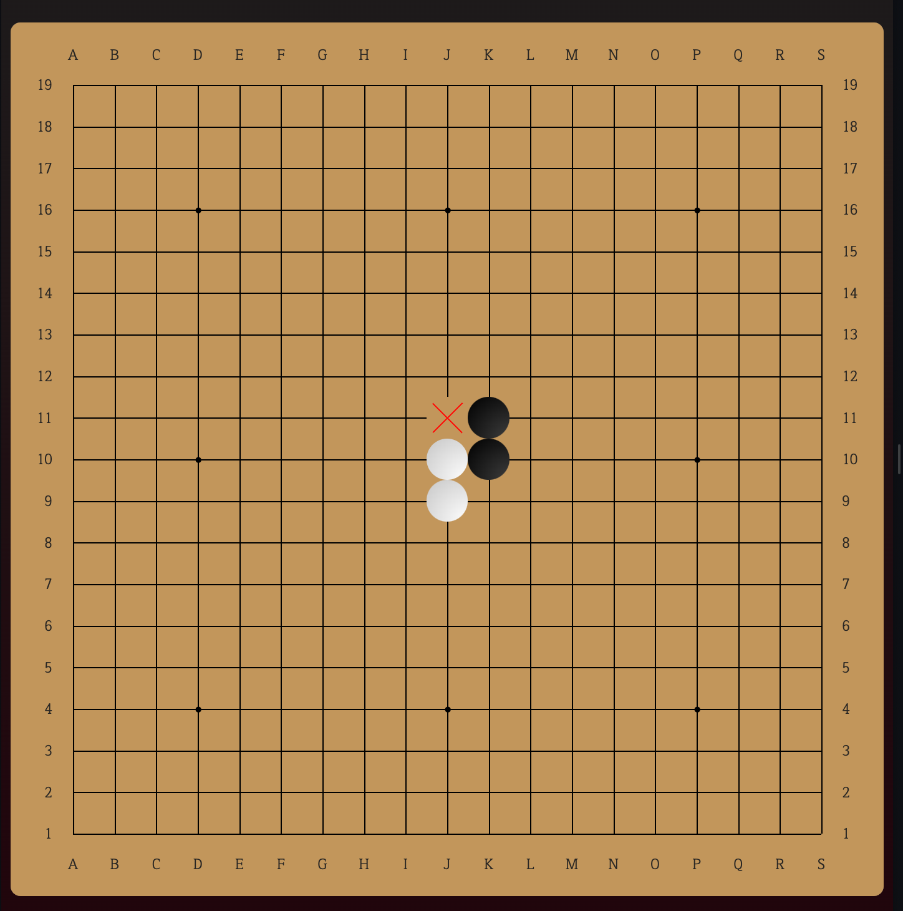

# 동시오목

상대방의 수를 예측하고, 동시에 돌을 놓는 새로운 방식의 오목!
서로 같은 자리에 돌을 놓으면 그 자리는 금지구역이 됩니다.
전략적 깊이가 더해진 오목을 즐겨보세요.

## 🎮 게임 규칙

### 기본 규칙
- 기존 오목처럼 5개의 돌을 연속으로 놓으면 승리합니다
- 가로, 세로, 대각선 모두 가능합니다
- 렌주룰을 따르지 않아 흑의 33, 44, 장목 등이 허용됩니다

### 특별 규칙
1. **동시에 돌 놓기**
   - 양 플레이어가 순서를 기다리지 않고 동시에 돌을 놓습니다
   - 이로 인해 상대방의 의도를 읽고 대응하는 전략이 중요해집니다

2. **금지 구역 생성**
   - 만약 두 플레이어가 같은 위치에 돌을 놓으려 한다면
   - 해당 위치는 X표시가 되며 양 플레이어 모두 돌을 놓을 수 없게 됩니다
   - 이를 통해 상대방의 필승 지점을 막는 새로운 전략이 가능합니다

### 게임 진행 화면

**1. 게임 시작**
- 상대방을 기다리는 동안 보이는 로딩 화면입니다


**2. 동시에 돌 놓기**
- 양 플레이어가 각자의 수를 고민하는 중입니다


**3. 금지 구역 생성**
- 두 플레이어가 같은 자리를 선택하면 해당 위치가 X표시로 변합니다


## 🚀 시작하기

### 온라인으로 플레이
- [동시오목 플레이하기](https://dongsi-omok.vercel.app)

### 로컬에서 실행하기
```bash
# 저장소 클론
git clone https://github.com/OnLee3/dongsi-omok.git
# 프로젝트 폴더로 이동
cd dongsi-omok
# 의존성 설치
pnpm i
# 클라이언트 실행
pnpm run dev:client
# 서버 실행
pnpm run dev:server
```

## 🛠 기술 스택

### Frontend
- Astro
- TypeScript
- WebSocket (SSE)

### Backend
- Node.js
- Express
- Bun
- TypeScript

## 🌟 주요 기능

- 실시간 멀티플레이어 대전
- 동시 턴 처리 시스템
- 승리 조건 자동 감지
- 재대결 시스템

## 📝 라이센스

이 프로젝트는 MIT 라이센스를 따릅니다:
- 자유로운 사용, 수정, 배포가 가능합니다
- 상업적 이용이 가능합니다
- 저작권 표시와 라이센스 사본만 유지하면 됩니다
